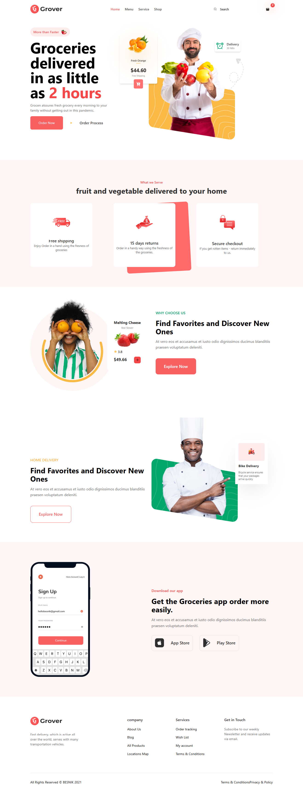

# Grover

Grover is a modern web application designed to provide fast and efficient grocery delivery services. With Grover, users can order fresh groceries delivered to their home in as little as 2 hours. The application offers a seamless user experience with its clean design and intuitive interface.

## Screenshots



## Features

- Clean and modern design
- Responsive layout for mobile and desktop
- Highlight of key features like fast delivery, free shipping, and secure checkout
- Call-to-action buttons for ordering and exploring the service
- Mobile app promotion with download links for iOS and Android

## Technologies Used

- **ReactJS**: A JavaScript library for building user interfaces.
- **TailwindCSS**: A utility-first CSS framework for rapid UI development.
- **TypeScript**: A typed superset of JavaScript that compiles to plain JavaScript.
- **HTML & CSS**: Markup and styling languages for web development.

## Installation

To run this project locally, follow these steps:

1. Clone the repository:
   ```bash
   git clone https://github.com/your-username/grover.git
